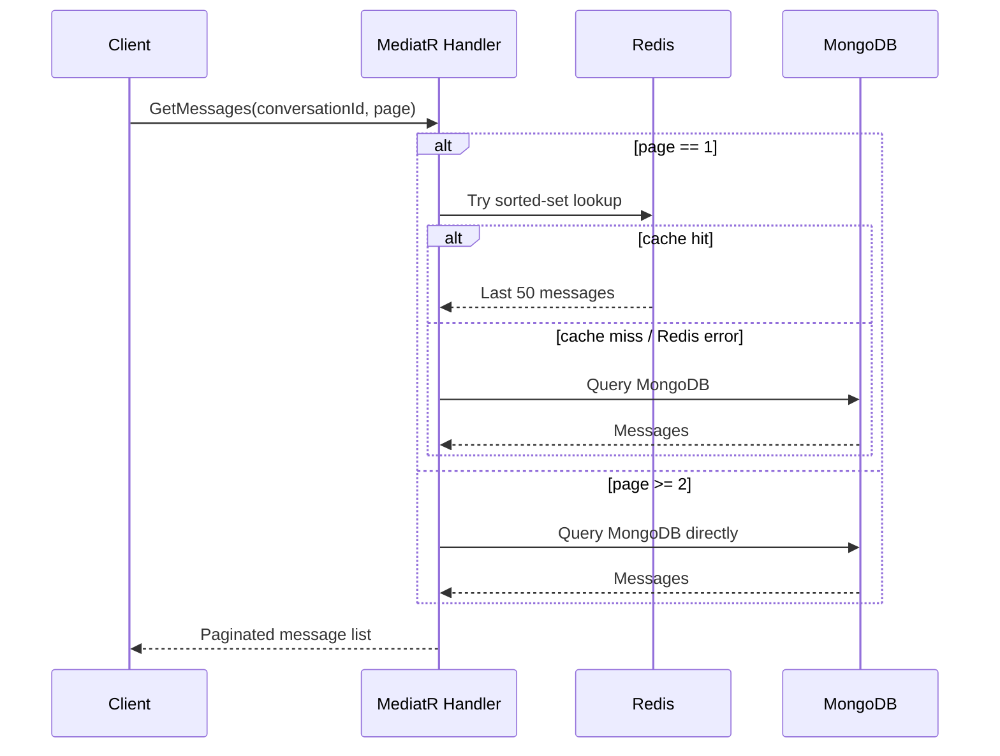
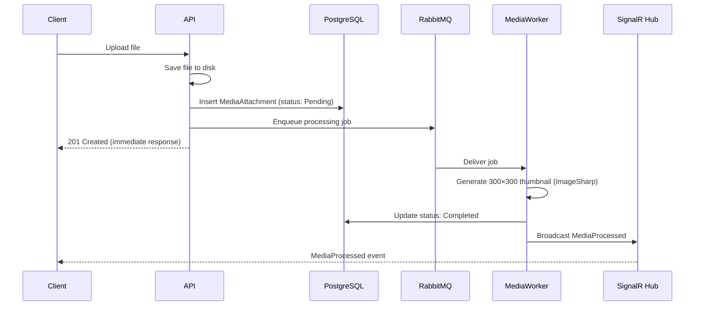
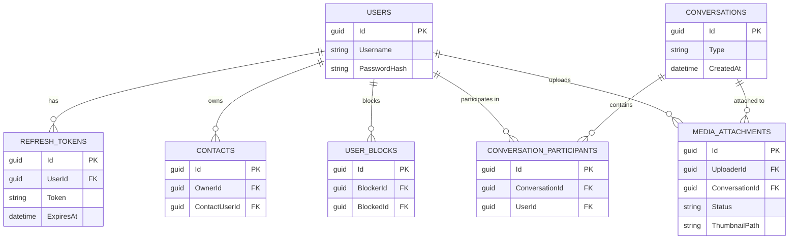

<div align="center">

# 💬 RealTime Chat

### A WhatsApp-Inspired, Production-Grade Messaging Backend

*Vertical Slice Architecture · CQRS · Polyglot Persistence · Event-Driven Media Processing*

[](#)
[](#)
[](#)
[](#)
[](#)
[](#)

[](#-license)
[](#)
[](#)
[](#)

</div>

---

## About This Project

This isn't a CRUD tutorial app. It's a deliberately engineered messaging backend built to demonstrate **real architectural decision-making** — the kind a backend engineer makes when trading off consistency, latency, and scalability against each other, rather than reaching for whatever a framework defaults to.

Every database, queue, and pattern in this system was chosen for a specific reason:

- **Why MongoDB for messages, but PostgreSQL for users?**
- **Why is Redis a best-effort cache instead of the source of truth?**
- **Why was the Repository pattern rejected for core data access?**
- **Why does RabbitMQ only touch media, and not the message-send path?**

Every one of those questions has a deliberate answer in this README — not just "because that's how it's usually done."

---

## 📑 Table of Contents

- [Highlights](#highlights)
- [Tech Stack](#tech-stack)
- [Architecture Deep Dive](#architecture-deep-dive)
- [Database Schema](#database-schema-postgresql)
- [API Surface](#api-surface)
- [SignalR Events](#-signalr-events)
- [Project Structure](#-project-structure)
- [Getting Started](#-getting-started)
- [Engineering Decisions & Lessons](#key-engineering-decisions--lessons)
- [Roadmap](#-roadmap)
- [License](#-license)

---

## Highlights

- **Custom JWT authentication** — access + refresh token rotation, built from scratch (no ASP.NET Identity)
- **Real-time messaging via SignalR** — on-demand group joining, not "join every conversation on connect"
- **True polyglot persistence** — PostgreSQL, MongoDB, and Redis each doing the job they're best at
- **Async media pipeline** — RabbitMQ-driven upload → thumbnail generation → notification, fully decoupled from the request/response cycle
- **Live presence & typing indicators** — Redis-backed, crash-safe, sub-second latency
- **Vertical Slice Architecture** — every feature is a self-contained folder: Command/Query, Handler, Endpoint
- **Custom WebSocket test client** — purpose-built browser tool because Postman doesn't test SignalR well

---

## Tech Stack

### Core Framework
| Tool | Role |
|---|---|
| **ASP.NET Core Web API** | Application host & HTTP layer |
| **MediatR** | In-process CQRS mediator — dispatches Commands/Queries to Handlers |
| **Entity Framework Core** | ORM for PostgreSQL access |
| **Npgsql** | PostgreSQL driver for EF Core |
| **SignalR** | Real-time, bidirectional WebSocket communication |
| **SixLabors.ImageSharp** | Server-side image processing — 300×300 thumbnail generation |

### Data Stores
| Store | Driver / Client | Role |
|---|---|---|
| **PostgreSQL** | Npgsql + EF Core | Relational source of truth: users, contacts, conversations, media metadata |
| **MongoDB** | MongoDB .NET Driver | Append-only, high-volume message storage (ULID-keyed) |
| **Redis** | StackExchange.Redis | Caching, presence tracking, typing indicators |

### Messaging & Background Work
| Tool | Role |
|---|---|
| **RabbitMQ** | Message broker for the async media-processing pipeline |
| **`MediaWorker`** (custom `BackgroundService`) | Consumes the queue, generates thumbnails, updates status, notifies clients |

---

## Architecture Deep Dive

### Vertical Slice Architecture + CQRS

Instead of organizing code by technical layer (`Controllers/`, `Services/`, `Repositories/`), every feature lives in its own folder containing everything it needs to function independently:

```
Featuers/Messaging/SendMessage/
├── SendMessageCommand.cs
├── SendMessageHandler.cs
└── SendMessageEndpoint.cs
```


**Why this over a layered architecture?**
Each slice is independently readable — opening one folder explains the entire feature, with no jumping between five layers to trace a single request. It also isolates risk: adding `DeleteMessage` cannot break `SendMessage`, because they don't share a bloated `MessageService`.

**MediatR** dispatches every Command/Query to its Handler. The **Repository pattern was deliberately rejected** for core data access — handlers talk to `DbContext` directly, since an abstraction layer over EF Core wasn't earning its keep at this scale. Thin wrapper interfaces exist *only* around Redis and RabbitMQ, purely to keep those dependencies mockable in tests.

---

### Polyglot Persistence — One Database, One Job Each

| Store | Responsibility | Why This Store |
|---|---|---|
| **PostgreSQL** | Users, Contacts, UserBlocks, Conversations, ConversationParticipants, RefreshTokens, MediaAttachments | Structured, relational, transactional — exactly what identity and relationship data needs |
| **MongoDB** | Append-only message storage, ULID-identified | Optimized for high-volume sequential writes and chronological reads; messages don't need relational integrity, they need throughput |
| **Redis** | Message cache, presence, typing indicators | Ephemeral, sub-millisecond state that has no business living in a durable store |

---

### Message Flow — MongoDB as Source of Truth, Redis as Best-Effort

Every message write lands in **MongoDB first** — the durable source of truth. Redis caching is **best-effort only**, wrapped in try/catch so a Redis outage never blocks or fails a message send.

**On read:**



- **Page 1** → Redis sorted set (50-message cap, 24-hour expiry) → falls back to MongoDB on miss or failure
- **Page 2+** → always reads MongoDB directly

This keeps the hot path — recent messages — fast, without ever making Redis a single point of failure for message delivery.

---

### Real-Time Layer — SignalR with On-Demand Group Joining

Rather than loading every conversation a user belongs to into SignalR groups at connection time — which degrades as a user's conversation count grows — groups are joined **on demand**:

- **`user:{id}`** — personal group, joined automatically on connect; used for cross-conversation notifications
- **`conversation:{id}`** — joined only when a user actually opens that specific chat

**On every sent message, two events fire:**

| Event | Target | Purpose |
|---|---|---|
| `ReceiveMessage` | `conversation:{id}` group | Delivers the message to anyone with that chat open |
| `ConversationUpdated` | Each participant's `user:{id}` group | Updates conversation-list previews even for chats that aren't open |

---

### 🟢 Presence & Typing — Redis, Built to Fail Gracefully

| Feature | Mechanism | Self-Healing Behavior |
|---|---|---|
| **Presence** | Key with 60-second expiry, refreshed by a 30-second client heartbeat | Ungraceful disconnects expire naturally within 60s — no manual cleanup |
| **Typing indicators** | Redis set membership, 5-second per-key expiry | A crashed client's "typing…" state self-clears instead of sticking forever |

---

### Media Pipeline — Fully Asynchronous



This ensures large file uploads never tie up a request thread, and the API stays responsive regardless of processing load or queue backlog.

---

## Database Schema (PostgreSQL)

Seven core tables, each configured via `IEntityTypeConfiguration<T>` under `Infrastructure/Persistence/PostgreSql/Configurations/`:



---

## API Surface

| Module | Endpoint Pattern | Method | Description |
|---|---|---|---|
| Auth | `/api/auth/register` | `POST` | Create a new account |
| Auth | `/api/auth/login` | `POST` | Authenticate, issue access + refresh tokens |
| Auth | `/api/auth/refresh` | `POST` | Rotate an access token using a refresh token |
| Auth | `/api/auth/logout` | `POST` | Revoke the active refresh token |
| Contacts | `/api/contacts` | `GET / POST / DELETE` | Manage contact relationships |
| Conversations | `/api/conversations` | `GET / POST` | Create and list conversations |
| Messaging | `/api/conversations/{id}/messages` | `GET` | Paginated message history (Redis → MongoDB) |
| Messaging | `/api/conversations/{id}/messages` | `POST` | Send a message |
| Messaging | `/api/messages/{id}` | `DELETE` | Delete a message |
| Media | `/api/media/upload` | `POST` | Upload a file for async processing |

*Exact route casing/structure may vary slightly by controller convention — see source for definitive routes.*

---

## 📡 SignalR Events

| Event | Direction | Trigger |
|---|---|---|
| `ReceiveMessage` | Server → Client | A new message is sent to an open conversation |
| `ConversationUpdated` | Server → Client | Any message send, to refresh conversation list previews |
| `MediaProcessed` | Server → Client | Background thumbnail generation completes |
| `UserTyping` | Server → Client | A participant starts typing |
| `UserOnline` / `UserOffline` | Server → Client | Presence heartbeat state change |

---

## 📁 Project Structure

```
src/
├── Featuers/                          # (sic) Vertical slices by module
│   ├── Auth/
│   │   ├── Register/
│   │   ├── Login/
│   │   ├── RefreshToken/
│   │   └── Logout/
│   ├── Contacts/
│   ├── Conversations/
│   ├── Messaging/
│   │   ├── SendMessage/
│   │   ├── GetMessages/
│   │   └── DeleteMessage/
│   └── Media/
│       └── UploadMedia/
│
├── Infrastructure/
│   ├── Persistence/
│   │   ├── PostgreSql/
│   │   │   └── Configurations/        # IEntityTypeConfiguration<T> per table
│   │   ├── MongoDb/
│   │   └── Redis/
│   ├── Messaging/
│   │   └── RabbitMq/
│   └── BackgroundServices/
│       └── MediaWorker.cs
│
├── Hubs/
│   └── ChatHub.cs
│
├── JwtServiceExtensions.cs            # JWT config extracted out of Program.cs
└── Program.cs                         # Kept intentionally minimal

test-client/                           # Custom HTML/CSS/JS WebSocket test harness
├── auth.html
├── contacts.html
├── conversations.html
├── chat.html
└── presence.html
```

---

## 🚀 Getting Started

### Prerequisites

- [.NET SDK](https://dotnet.microsoft.com/download)
- [PostgreSQL](https://www.postgresql.org/download/)
- [MongoDB](https://www.mongodb.com/try/download/community)
- [Redis](https://redis.io/download)
- [RabbitMQ](https://www.rabbitmq.com/download.html)

### Setup

```bash
# Clone the repository
git clone https://github.com/mohamed1080p/Web-messaging-app
cd Web-messaging-app

# Restore dependencies
dotnet restore

# Apply EF Core migrations (PostgreSQL)
dotnet ef database update

# Run the API
dotnet run
```

### Configuration

Add connection strings and secrets to `appsettings.Development.json` or user-secrets:

```json
{
  "ConnectionStrings": {
    "Postgres": "Host=localhost;Database=realtimechat;Username=postgres;Password=postgres",
    "MongoDb": "mongodb://localhost:27017",
    "Redis": "localhost:6379"
  },
  "RabbitMq": {
    "Host": "localhost",
    "Username": "guest",
    "Password": "guest"
  },
  "Jwt": {
    "Issuer": "RealtimeChat",
    "Audience": "RealtimeChatClient",
    "SecretKey": "<your-secret-key>",
    "AccessTokenExpiryMinutes": 15,
    "RefreshTokenExpiryDays": 7
  }
}
```

---

## Key Engineering Decisions & Lessons

> **Why is MongoDB the source of truth, not Redis?**
> Redis is fast but ephemeral and best-effort by design. Message durability can never depend on a cache — if Redis is down, messages still need to land safely.

> **Why is RabbitMQ scoped to media only?**
> Write-behind buffering for the message-send path itself was considered and **explicitly rejected**. Direct MongoDB writes were simpler and just as fast for this workload, without adding a queue as a dependency in the critical send path.

> **Why on-demand SignalR groups instead of joining everything on connect?**
> Loading every conversation into groups at connect time doesn't scale as a user's conversation count grows. Joining only the active conversation keeps per-connection overhead flat regardless of how many conversations a user has.

> **Why no Repository pattern over EF Core?**
> At this project's scale, `DbContext` access directly in handlers was simpler and more transparent than an abstraction layer that wasn't earning its keep. Thin interfaces were kept *only* where testability genuinely mattered — Redis and RabbitMQ.


---

## 🚧 Roadmap

- [ ] Hash refresh tokens
- [ ] Offline push notification delivery via RabbitMQ
- [ ] Frontend
- [ ] Rate limiting

---

## 📄 License

Distributed under the **MIT License**. See `LICENSE` for details.
